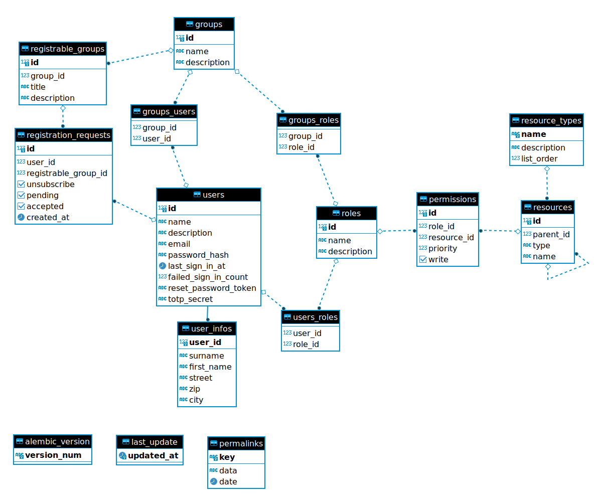

[](https://github.com/qwc-services/qwc-base-db/actions)
[](https://hub.docker.com/r/sourcepole/qwc-base-db)

QWC Base DB
===========

This repository creates two Docker images:

* `qwc-base-db`: Image with a postgis server and the minimal schemas and roles for the QWC Config DB
* `qwc-base-db-migrate`: Image containing `alembic` and the migrations to update the QWC Config DB to the latest schema

These images are designed to be configured in a `docker-compose.yml` as follows (minimal configuration):

```yml
  qwc-postgis:
    image: sourcepole/qwc-base-db:<version>
    healthcheck:
      test: ["CMD-SHELL", "pg_isready -U postgres"]
      interval: 10s
    environment:
      POSTGRES_PASSWORD: '' # TODO: Set your postgres password here!
    volumes:
     - ./volumes/db:/var/lib/postgresql/docker

  qwc-config-db-migrate:
    image: sourcepole/qwc-base-db-migrate:<version>
    depends_on:
      qwc-postgis:
        condition: service_healthy
```

Note:

* **You need to set a non-empty `POSTGRES_PASSWORD` ENV variable**.
* For persistent storage, mount folder volume to `/var/lib/postgresql/docker`.

When the `qwc-postgis` image is run, then it checks whether `/var/lib/postgresql/docker` is empty.
If that's the case then it will proceed with setting up the
`qwc_configdb` DB.

The `qwc-config-db-migrate` image will run `qwc-postgis` is up, and will apply all available migrations to the Config DB.

# Keeping the Config DB up-to-date

To keep the Config DB up to date, it is sufficient to update the `qwc-base-db-migrate` image version to the latest available version.

Migrations will be applied automatically, if necessary, whenever the Docker application is started.

To upgrade to a migration different than `head`, set the `ALEMBIC_VERSION` ENV variable.

# Managing an external Config DB

You can use an external DB instead of the `qwc-base-db` dockerized DB.

To set up the external DB, run the SQL commands in `setup-roles-and-db.sh` on your external DB.

To apply the migrations, both as part as the initial setup and subsequently to keep the Config DB up-to-date:

* Modify the `qwc_configdb` connection in `pg_service.conf` with the connection information to your external DB
* Configure the `qwc-config-db-migrate` image mounting the modified `pg_service.conf`:

```yml
  qwc-config-db-migrate:
    image: sourcepole/qwc-base-db-migrate:<version>
  volumes:
    ./pg_service.conf:/tmp/pg_service.conf:ro
```

# DB Schema overview


